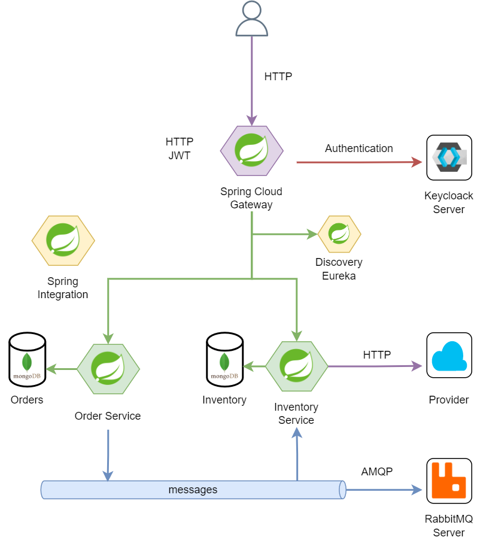

# Sample App

## Overview

This sample app exposes a REST API. It’s built using Spring. It manages orders.

### Components

**discovery:** It’s a registration and discovery service that helps to map every microservice within the app, it allows to point other services using the name instead of the IP, it also checks wherever a microservice instance is up or not.

Docs: [Discovery Service](https://spring.io/projects/spring-cloud-netflix#overview)

**gateway** It provides the entry point for the app, routing each request to the respective endpoint. It also secures the app, checking for authenticated users and their roles. It uses Keycloak for generate and validate JWT tokens.

Docs: [API Gateway](https://spring.io/projects/spring-cloud-gateway#overview), [Security](https://spring.io/projects/spring-authorization-server#overview) 

**order service**: This is microservice which provides a REST API for order management. It’s connected to its own database and uses rabbitmq for sending messages in order to check the inventory needed on the order. It also uses Spring integration for controlling the flow on the confirmed inventory.

Docs: [Webservice](https://spring.io/projects/spring-ws#overview), [Database](https://spring.io/projects/spring-data-mongodb#overview), [Messaging](https://spring.io/projects/spring-amqp#overview), [Integration](https://spring.io/projects/spring-integration#overview)

**inventory service:** This is a microservice which provides a REST API for the inventory management. It’s connected to its own database, uses rabbitmq to get orders that needs some products from the inventory, it uses Integration for this inventory check and sends back a confirmation trough rabbitmq.

Docs: [Webservice](https://spring.io/projects/spring-ws#overview), [Database](https://spring.io/projects/spring-data-mongodb#overview), [Messaging](https://spring.io/projects/spring-amqp#overview), [Integration](https://spring.io/projects/spring-integration#overview)

## Diagram



## How to run

### Prerequisites

- Java 11+
- Maven
- MongoDB, RabbitMQ and Keycloak services.

### Run the app

From each root directory run:

```bash
mvn spring-boot:run
```

## Endpoints

The application is accessed from the base URI on the gateway service:

http://localhost:5051/api/v1 , it uses a bearer token.

The app doesn't provide an endpoint for request a token, a token can be request via Keycloak using the URL: {keycloak-server}/auth/realms/{real-name}/protocol/openid-connect/token and providing the needed credentials 

| Endpoint                         | HTTP Method | Role          |
|----------------------------------|-------------|---------------|
| /orders                          | GET         | -             |
| /orders/{order-id}               | GET         |               |
| /orders                          | POST        | admin, client |
| /orders/{order-id}               | PUT         | admin, client |
| /orders/{order-id}               | DELETE      | admin         |
| /inventory/products              | GET         | -             |
| /inventory/products/{product-id} | GET         | -             |
| /inventory/products/             | POST        | admin         |
| /inventory/products/{product-id} | PUT         | admin         |
| /inventory/products/{product-id} | DELETE      | admin         |
